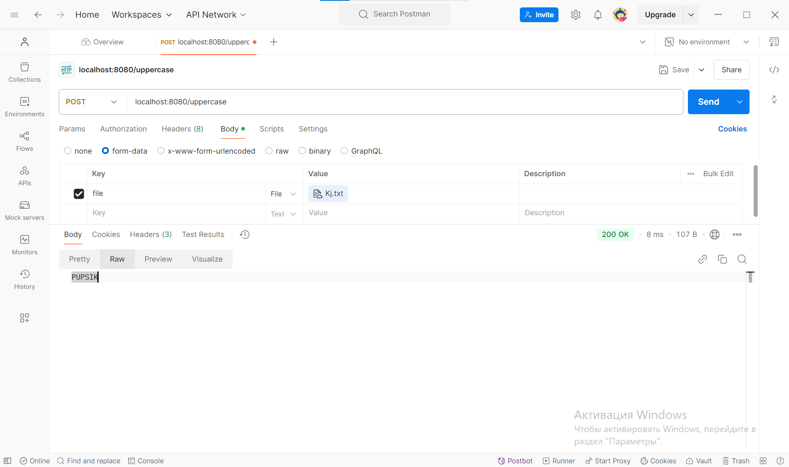

Дорогой дневник, мне не описать ту боль когда я увидел бэкэнд Дениса на C#.

Сейчас тут написан простенький сервер на go. Он принимает txt файл и возвращает его содержимое капсом.
Это было сделанно для проверки его работоспособности на предмет работы с txt.
В скором времени надо постараться подключить elevenlabs или что-то похожее, и разобраться как отправлять аудофайлы
обратно на клиент

тестирование